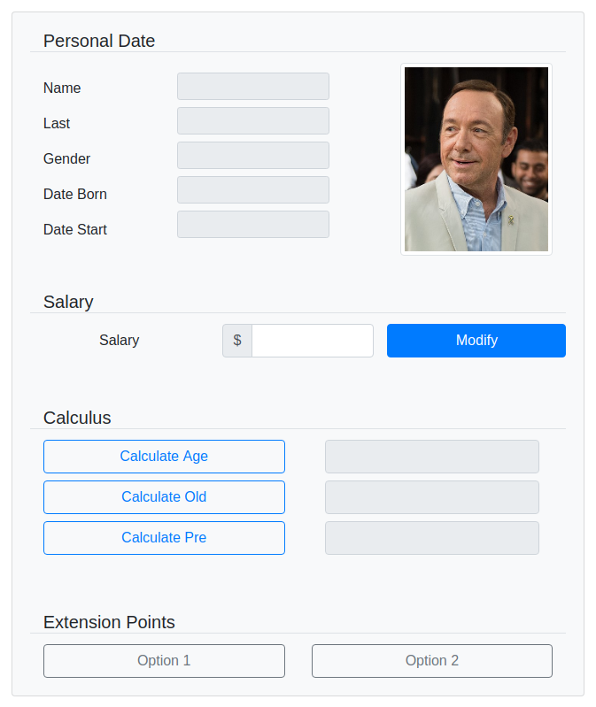

# Description

## Enunciated

We want an application that allows us to manage the information of an employee.
The employee has name, surname, gender, date of birth and an associated image.
Also, since he works in a certain company he has a date of entry to the
and an assigned base salary.

In the application you can (1) change the employee's salary and (2) perform
calculations with the available information:
(a) current age, (b) length of service, and (c) benefits at which you have
right.
The formula p = ( a * s ) / 12
(p: benefits, a: seniority, s: salary).

## Interface

    

